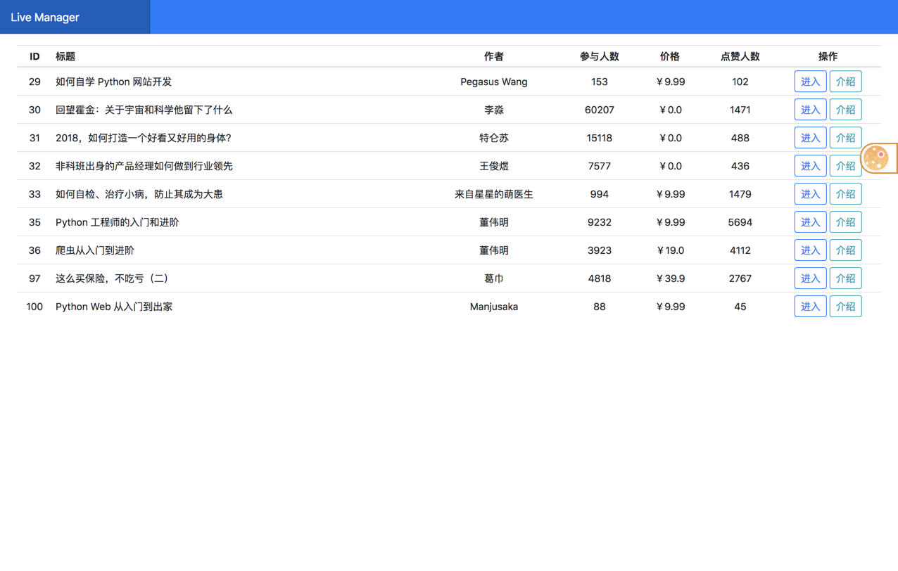
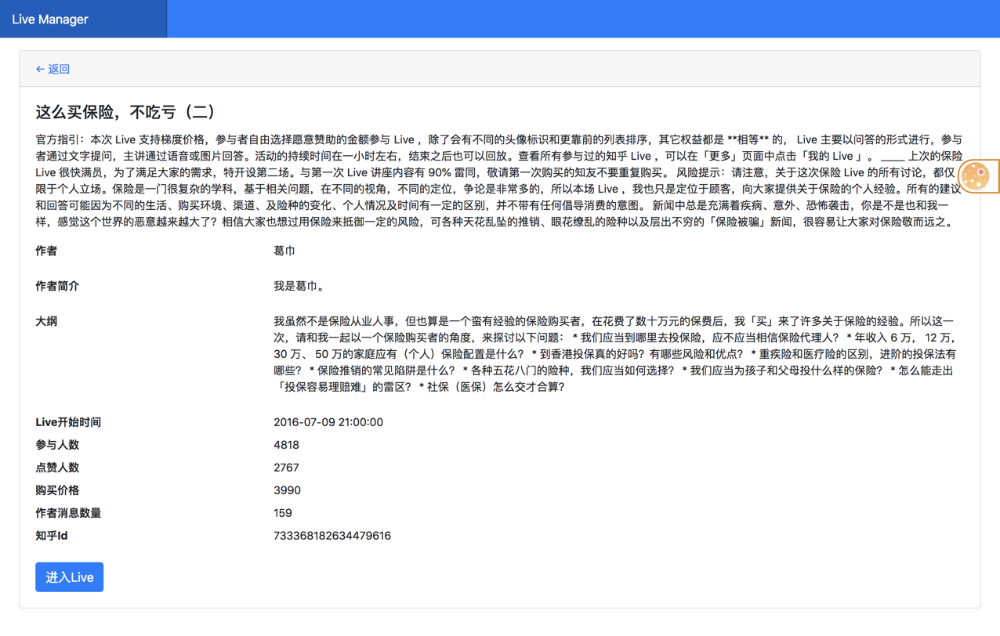
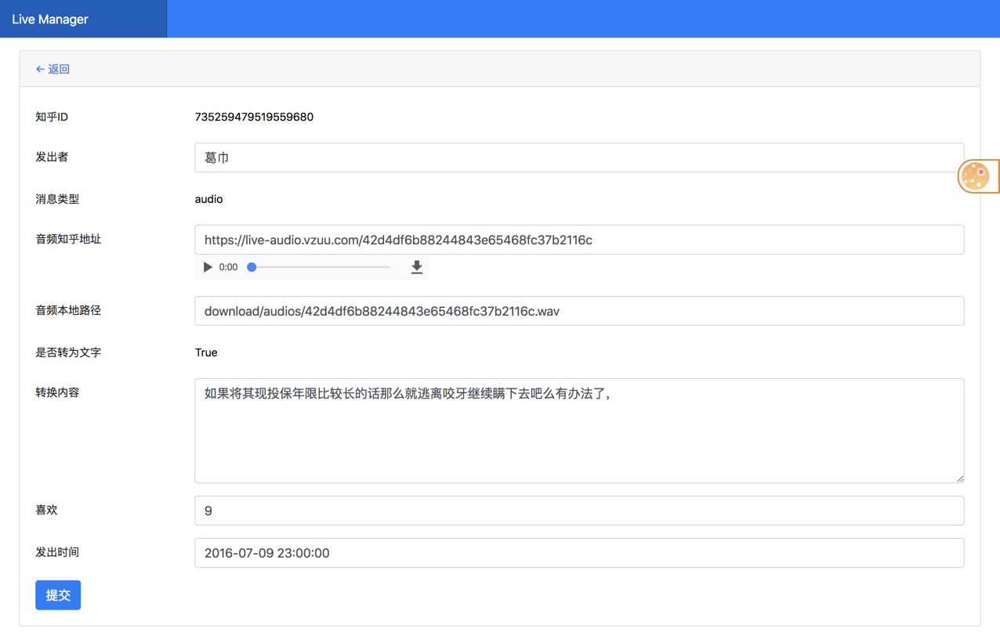

# 知乎Live内容管理器


## 简介
这是一个管理你购买过的知乎LIVE的工具，使用场景是往往我们听过的live是语音格式，无法保存、沉淀和搜索。知乎live本身做为一个付费内容，它的内容价值较高，所以做这样的工具能帮助自己更好的管理知识。希望您能注重版权，切勿随意分享自己购买过的live。

## 预览







## 安装和使用

### 使用技术
* 使用async做网络请求的处理，包括抓取知乎的live内容、将live中的音频提交至其他平台做文字转化、Web服务器。
* 使用百度提供的[API](http://yuyin.baidu.com/)进行语音文字之间的转换(经过实验对比，百度的转化效果最好)。
* 需要安装[ffmpeg组件](https://www.ffmpeg.org/),因为知乎的音频格式为aac，而百度需要其他格式。

### 安装及使用
1、创建MYSQL数据库，需要数据库字符集为utf8mb4，否则emoji表情字符串导致无法插入数据

2、安装pipenv
```angular2html
pip install pipenv
```
3、安装依赖，并修改config.py内的相关数据库配置
```angular2html
pipenv install
```
4、建表
```angular2html
pipenv shell
python run.py initdb
```
5、爬取(命令行内输入知乎用户名密码)
```angular2html
python run.py crawl
```
6、转化
```angular2html
python run.py transform
```
7、启动管理后台
```angular2html
python run.py webserver
```

### 备注
* [之前版本](https://github.com/hjlarry/zhihulive/tree/second_version)使用不同技术栈开发
* 欢迎提PR
